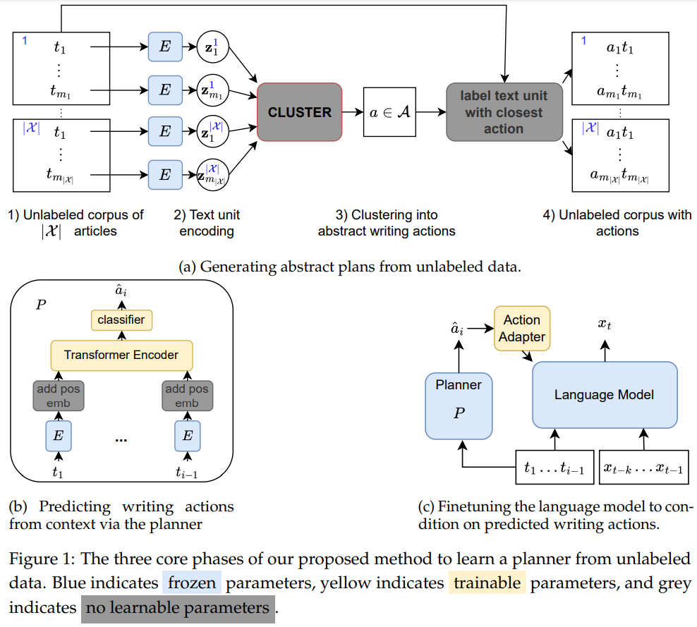

# Learning to Plan for Language Modeling from Unlabeled Data

This repository contains the code for the paper ["Learning to Plan for Language Modeling from Unlabeled Data"](https://arxiv.org/abs/2404.00614) by Nathan Cornille, Marie-Francine Moens, and Florian Mai.

## Introduction

This project introduces a novel approach to improve language modeling by incorporating a planning module trained on unlabeled data. Our method enhances the standard language model architecture by conditioning on generated latent plans, leading to improved performance, particularly in text structure. The unsupervised nature of our planner module allows for large-scale training, and the externality of the planner allows for easy sharing of trained planners with the community.



## Requirements

The code has been tested with Python 3.11.

In order to install the required packages, run:
```bash
pip install -r requirements.txt
```

## Running Experiments

First, you need to set some parameters (paths, etc.) in the `constants.py` file to fit your environment.
Then, you can refer to the `experiments.txt` file to run the main experiments from the paper.

Note:
* The first run of the experiments will take a while, as the code will download the dataset and preprocess it, including performing the k-means clustering to obtain abstract writing actions. This takes a few hours and can take up to a few 100s of GBs of RAM, depending on the size of the dataset.
* The code will save the preprocessed data in the `pickles` directory specified in `constants.py`.
* The code will save the checkpoints in the `checkpoints` directory specified in `constants.py`.
* Unfortunately, the initialization of the planner module is not dependent on the seed, so you might get different results if you run the experiments multiple times. However, the differences are small and do not affect the conclusions of the paper.

## Code Structure
The key components of our models are found in the following directories and files.

* muzero-llm/muzero-core: contains the base logic of the planner. It is roughly inspired by the MuZero architecture, although the present paper only predicts a single step into the future.
* models/muzero.py: A torch lightning wrapper for the planner.
* models/cc_models/: contains HF implementations of GPT-2 and OLMo models with the added modification of integrating the action adapter.

## Citation

If you find this work useful in your research, please consider citing:

```bibtex
@inproceedings{cornille2024learning,
title={Learning to Plan for Language Modeling from Unlabeled Data},
author={Cornille, Nathan and Moens, Marie-Francine and Mai, Florian},
booktitle={Proceedings of the 1st Conference on Language Modeling (COLM)},
year={2024},
url={https://arxiv.org/abs/2404.00614}
}
```

This work has been accepted for presentation at the [1st Conference on Language Modeling (COLM)](https://colmweb.org/).